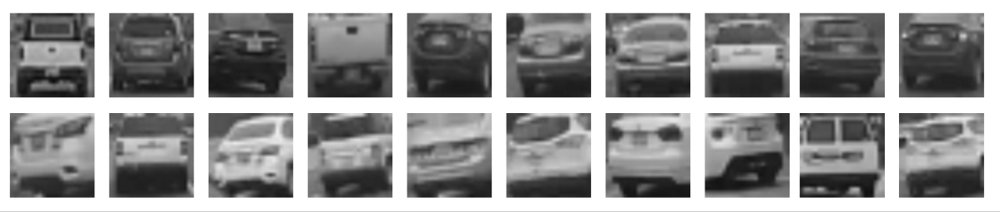

HazCam
=======

<div style='position:relative;padding-bottom:57%'><iframe src='https://gfycat.com/ifr/FaithfulLimpLacewing' frameborder='0' scrolling='no' width='100%' height='100%' style='position:absolute;top:0;left:0;' allowfullscreen></iframe></div>

## Distance Estimation in Monocular Dash Camera Footage

HazCam is a tool that uses OpenCV to analyse dashcam footage. It estimates following distance (in seconds) to the 
other cars on the road and displays a warning when following too close. 

### How to Get HazCam
```bash
git clone git@github.com:alex-sherman/hazcam.git
sudo pip install opencv-python
```

### Running HazCam
```bash
python ./hazcam.py "path_to_video.mp4"
```

Press space to begin video playback. 

Press Enter to move forward one frame.

### How HazCam Works

#### Edge Detection
Canny edge detection is first used to find edges in each frame of the input video. 

<div style='position:relative;padding-bottom:57%'><iframe src='https://gfycat.com/ifr/PlainBothFireant' frameborder='0' scrolling='no' width='100%' height='100%' style='position:absolute;top:0;left:0;' allowfullscreen></iframe></div><br>

#### Line Detection
Probabilistic Hough line detection is used with filtering by angle to find an estimate of the lane lines in the current frame. 
As you can see in the video below, this estimate is somewhat inconsistent and variable. 

<div style='position:relative;padding-bottom:57%'><iframe src='https://gfycat.com/ifr/LiquidFrightenedChrysomelid' frameborder='0' scrolling='no' width='100%' height='100%' style='position:absolute;top:0;left:0;' allowfullscreen></iframe></div><br>

#### Lines With Masks
To improve the lane line estimation, an exponential weighted moving average of the recent frame's lane lines is dilated to create a binary mask over the axis of each lane line. 

<div style='position:relative;padding-bottom:57%'><iframe src='https://gfycat.com/ifr/AdmiredSneakyFinwhale' frameborder='0' scrolling='no' width='100%' height='100%' style='position:absolute;top:0;left:0;' allowfullscreen></iframe></div><br>

#### Lane Line Edge Detection
Using the masked area, the edges of the actual painted lane markers on the road can be found. 

<div style='position:relative;padding-bottom:57%'><iframe src='https://gfycat.com/ifr/KeyPoorCow' frameborder='0' scrolling='no' width='100%' height='100%' style='position:absolute;top:0;left:0;' allowfullscreen></iframe></div><br>

#### Filled Lane Markers
The edges of the detected lane markers are dilated and then eroded to produce a filled marker, which can then be examined for endpoints. 
<div style='position:relative;padding-bottom:57%'><iframe src='https://gfycat.com/ifr/EverlastingDiscreteArabianwildcat' frameborder='0' scrolling='no' width='100%' height='100%' style='position:absolute;top:0;left:0;' allowfullscreen></iframe></div><br>

#### Lane Markers With Endpoints
The Suzuki85 contour detection algorith is used to bound each line marker which allows the endpoints to be determined from the +-Z extrema of each bound. 
<div style='position:relative;padding-bottom:57%'><iframe src='https://gfycat.com/ifr/ImpressionableQuickAmericanbobtail' frameborder='0' scrolling='no' width='100%' height='100%' style='position:absolute;top:0;left:0;' allowfullscreen></iframe></div><br>

#### Lane Plane Calculation

<div style='position:relative;padding-bottom:57%'><iframe src='https://gfycat.com/ifr/GeneralPaltryAdamsstaghornedbeetle' frameborder='0' scrolling='no' width='100%' height='100%' style='position:absolute;top:0;left:0;' allowfullscreen></iframe></div><br>

#### Haar Detection
Haar detection of other vehicles on the road is done using a classifier trained specifically to detect the 
rear bumpers of other vehicles on the road. We have released the trained classifier and data set at 
[OpenCV Dashcam Car Detection](https://github.com/pddenhar/OpenCV-Dashcam-Car-Detection).

The training set currently includes 469 hand cropped positive samples taken from dashcam footage,
and 450 negative samples. 



Detected objects are filtered and tracked between frames, with some motion smoothing applied:
<div style='position:relative;padding-bottom:57%'><iframe src='https://gfycat.com/ifr/ImpartialSnappyCollardlizard' frameborder='0' scrolling='no' width='100%' height='100%' style='position:absolute;top:0;left:0;' allowfullscreen></iframe></div><br>

### Demo Reel:
<iframe src="https://drive.google.com/file/d/0B_olmC0u8E3gSDBvOGg5d2hnQmM/preview" width="640" height="480"></iframe>

[Project Proposal](https://docs.google.com/document/d/1xAfiptcw-BP43Y73e1GKuuoaTu00bep4NjTmwwQRHBw/pub)

